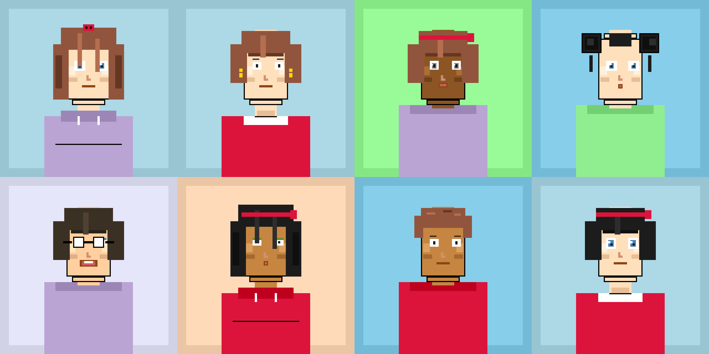

# Pixel-Art Avatar Generator

A high-quality pixel-art avatar generator with detailed facial features, hair styles, clothing, and accessories. Generates crisp 160×160 pixel avatars with proper pixel-art styling and nearest-neighbor scaling.

**Reference Style**: Based on detailed pixel-art avatars with layered features, cohesive color palettes, and professional pixel-art techniques.

## ✨ Features

### High-Quality Pixel Art
- **Canvas**: 160×160 logical pixels with 4× display scaling (640×640)
- **Crisp rendering**: Nearest-neighbor scaling preserves pixel edges
- **Cohesive palette**: Limited color palette with midtones, highlights, and shadows
- **Professional style**: Matches reference pixel-art quality

### Modular Layer System
Each avatar is composed of customizable layers:

1. **Background** (5 options)
   - Solid colors with subtle borders
   - Cyan blue, light blue, mint, lavender, peach

2. **Face Base** (5 skin tones)
   - Light, medium, tan, dark, peach
   - Includes shading and highlights

3. **Eyes** (5 styles × 4 colors)
   - Round, wide, sleepy, angry, cute
   - Brown, blue, green, gray
   - White highlights for depth

4. **Nose** 
   - Subtle L-shape shading

5. **Mouth** (5 styles)
   - Smile, neutral, laugh, small, open

6. **Hair** (6 styles × 6 colors)
   - Short curly, buns, long straight, bob, messy, pixie
   - Brown, dark brown, black, blonde, red, auburn
   - Shading and highlights for dimension

7. **Clothing** (5 styles with color variants)
   - Hoodie (with drawstrings)
   - Collar shirt
   - Suspenders
   - Turtleneck
   - Tank top

8. **Accessories** (5 options)
   - None, glasses, earrings, headband, bow

### Advanced Features
- **Deterministic seeding**: Same seed = same avatar
- **PNG export**: Save at 1× (160×160) or 4× (640×640) resolution
- **Color palette system**: JSON-based, easy to customize
- **Windows .exe**: Standalone executable for easy distribution

## 🚀 Quick Start

### Running from Python

#### Prerequisites
- Python 3.6 or higher
- Pygame 2.0+

#### Installation

1. Clone the repository:
   ```bash
   git clone https://github.com/terryberryLZ/interactive-design.git
   cd interactive-design
   ```

2. Install dependencies:
   ```bash
   pip install -r requirements.txt
   ```

#### Running the Generator

```bash
python pixel_avatar_generator.py
```

#### Controls
- **Click anywhere**: Generate a new random avatar
- **Press 'S'**: Save current avatar as PNG (1× and 4× versions)
- **Press 'Q'**: Quit the application

### Running the Windows .exe

1. Download the latest release (or build from source)
2. Extract the files
3. Double-click `PixelAvatarGenerator.exe`
4. The `color_palette.json` file must be in the same directory as the .exe

**Note**: Windows may show a SmartScreen warning for unsigned executables. Click "More info" → "Run anyway" if you trust the source.

## 🔨 Building Windows Executable

### Prerequisites for Building
- Windows 10/11
- Python 3.6+ installed and in PATH
- Internet connection (for downloading dependencies)

### Build Steps

#### Option 1: Using Batch Script (Recommended)

1. Open Command Prompt in the project directory
2. Run the build script:
   ```batch
   build_exe.bat
   ```

#### Option 2: Using PowerShell Script

1. Open PowerShell in the project directory
2. Run the build script:
   ```powershell
   .\build_exe.ps1
   ```

#### Option 3: Manual Build

1. Install PyInstaller:
   ```bash
   pip install pyinstaller pygame
   ```

2. Build the executable:
   ```bash
   pyinstaller --clean --onefile avatar_generator.spec
   ```

3. Copy required files:
   ```bash
   copy color_palette.json dist\
   ```

### Build Output

After successful build:
- Executable: `dist\PixelAvatarGenerator.exe`
- Size: ~15-25 MB (includes Python runtime, Pygame, and all dependencies)
- Required files: The `color_palette.json` must be in the same directory

### Distribution

To distribute the application:
1. Zip the entire `dist` folder, or
2. Distribute just the .exe and color_palette.json together

### Known Build Issues

**Large Binary Size**
- The .exe includes the entire Python runtime and Pygame
- This is normal for PyInstaller executables
- Use UPX compression (enabled by default) to reduce size

**Antivirus False Positives**
- Some antivirus software may flag PyInstaller executables
- This is a known issue with all PyInstaller-created executables
- Users may need to whitelist the executable or disable antivirus temporarily

**Build Errors**
- Ensure Python is in PATH: `python --version`
- Ensure pip is up to date: `python -m pip install --upgrade pip`
- Clear previous builds: Delete `build`, `dist`, and `__pycache__` folders

### Testing the Executable

It's recommended to test on a clean Windows environment:
- Windows VM without Python installed
- Another computer without development tools
- Windows Sandbox (Windows 10 Pro+)

Test checklist:
- [ ] .exe launches without errors
- [ ] color_palette.json is loaded correctly
- [ ] Avatar generation works
- [ ] PNG export (S key) works
- [ ] Window resizing and closing work correctly

## 🎨 Customization

### Color Palette

The `color_palette.json` file contains all colors used by the generator. You can easily customize colors by editing this file.

Structure:
```json
{
  "palettes": {
    "backgrounds": { "cyan_blue": [173, 216, 230], ... },
    "skin_tones": { "light": [255, 224, 189], ... },
    "hair_colors": { "brown": [101, 67, 33], ... },
    ...
  }
}
```

Each color is defined as an RGB array: `[red, green, blue]` (0-255).

### Adding New Variants

To add new hair styles, clothing, or accessories, edit `pixel_avatar_generator.py`:

1. Add the new variant name to the appropriate list:
   ```python
   self.hair_styles = ['short_curly', 'buns', ..., 'your_new_style']
   ```

2. Implement the drawing function:
   ```python
   def _draw_your_new_style(self, canvas, color, ...):
       # Draw your new style using canvas.draw_rect()
       pass
   ```

3. Add a case in the main drawing function:
   ```python
   elif hair_style == 'your_new_style':
       self._draw_your_new_style(canvas, hair, shadow, highlight, outline)
   ```

### Deterministic Generation

Generate the same avatar by providing a seed:

```python
from pixel_avatar_generator import AvatarGenerator, ColorPalette, PixelCanvas

palette = ColorPalette()
canvas = PixelCanvas(160, 160)
generator = AvatarGenerator(palette, seed=12345)
generator.generate_random()
generator.draw(canvas)
canvas.save_png("my_avatar.png", scale=4)
```

## 📁 Project Structure

```
interactive-design/
├── pixel_avatar_generator.py   # Main enhanced generator
├── fantasy_avatar_generator.py # Legacy fantasy version
├── color_palette.json           # Color definitions
├── avatar_generator.spec        # PyInstaller spec file
├── build_exe.bat                # Windows batch build script
├── build_exe.ps1                # PowerShell build script
├── generate_samples.py          # Sample generation script
├── requirements.txt             # Python dependencies
└── README.md                    # This file
```

## 🧪 Technical Details

### Architecture

**PixelCanvas Class**
- Manages a logical pixel grid (160×160)
- Provides drawing primitives: `set_pixel()`, `draw_rect()`, etc.
- Handles nearest-neighbor scaling
- Exports PNG at any scale factor

**ColorPalette Class**
- Loads colors from JSON file
- Provides color lookup by category and name
- Falls back to defaults if JSON is missing

**AvatarGenerator Class**
- Generates random avatar configurations
- Draws avatars using modular layer system
- Each layer is an independent method
- Supports deterministic seeding

### Layer Drawing Order
1. Background (with optional border)
2. Body/clothing
3. Face base (with shading)
4. Eyes (with highlights)
5. Nose (subtle shading)
6. Mouth (various expressions)
7. Hair (with shadows and highlights)
8. Accessories (glasses, earrings, etc.)

### Pixel-Art Techniques Used
- **Limited palette**: Cohesive color scheme
- **Nearest-neighbor scaling**: Preserves crisp pixel edges
- **Manual shading**: Shadow and highlight colors for depth
- **Outlines**: Black outlines for definition
- **Layering**: Proper z-order for realistic composition

## 📝 License and Credits

### License
This project is open source and available under the MIT License.

### Color Palette
The color palette (`color_palette.json`) is released under the MIT License and is free to use and modify.

### Third-Party Dependencies
- **Pygame**: LGPL License - https://www.pygame.org/
- **Python**: PSF License - https://www.python.org/

### Reference Images
The avatar style is inspired by high-quality pixel-art reference images provided in the project requirements. No copyrighted assets are included in this project.

### Assets and Fonts
This project uses only programmatically generated graphics. No external fonts or image assets are required or included.

## 🚧 Future Enhancements

### Potential Features
- [ ] Web version using Pygame + WASM
- [ ] More hair styles and clothing options
- [ ] Animation support (blinking, idle movements)
- [ ] Background scene elements
- [ ] Avatar name generator
- [ ] Batch generation tool
- [ ] GUI for manual customization
- [ ] Export to animated GIF

### Platform Support
- ✅ **Windows**: Standalone .exe supported
- ⚠️ **macOS**: Python source works; .app packaging possible with py2app
- ⚠️ **Linux**: Python source works; AppImage packaging possible
- 🔄 **Web**: Possible with Pygbag or Pyodide (future)

To create macOS builds:
```bash
pip install py2app
python setup.py py2app
```

To create Linux AppImages:
```bash
# Use PyInstaller for Linux
pyinstaller --onefile avatar_generator.spec
# Then package with AppImage tools
```

## 🐛 Troubleshooting

### Common Issues

**"Module 'pygame' not found"**
- Install pygame: `pip install pygame`

**"color_palette.json not found"**
- Ensure the JSON file is in the same directory as the script/exe

**Colors look wrong**
- Check that color_palette.json is valid JSON
- Ensure RGB values are in range 0-255

**Build fails on Windows**
- Ensure Python is in PATH
- Run as Administrator if permissions error
- Clear build cache: Delete `build`, `dist`, `__pycache__`

**Executable won't run**
- Check if antivirus is blocking it
- Ensure color_palette.json is present
- Run from command prompt to see error messages

## 📚 Additional Documentation

- `USAGE.md` - Detailed usage instructions (legacy)
- `DEVELOPMENT.md` - Development guidelines (legacy)
- `EXAMPLES.md` - Code examples (legacy)
- `DEMO_GUIDE.md` - Demo and presentation guide (legacy)

## 🤝 Contributing

Contributions are welcome! To contribute:

1. Fork the repository
2. Create a feature branch
3. Make your changes
4. Test thoroughly (especially if adding new variants)
5. Submit a pull request

Please ensure:
- New code follows the existing style
- Colors are added to color_palette.json
- Documentation is updated
- Changes are minimal and focused

## 💬 Support

For issues, questions, or suggestions:
- Open an issue on GitHub
- Check existing issues for solutions
- Include error messages and system info

## 🎯 Project Goals

This project demonstrates:
- ✅ High-quality pixel-art generation
- ✅ Modular, maintainable code architecture
- ✅ Proper color palette management
- ✅ Nearest-neighbor scaling for crisp pixels
- ✅ Cross-platform compatibility
- ✅ Easy distribution via standalone executable
- ✅ Comprehensive documentation

Perfect for:
- Game development (character portraits)
- Profile pictures / avatars
- Learning pixel-art programming
- Procedural generation examples
- UI/UX mockups

## 🖼️ Showcase

Sample avatars generated by the enhanced pixel-art generator:



*Generated avatars showing various combinations of hair styles, clothing, and accessories with proper pixel-art styling*

---

**Note**: This is the enhanced version with improved pixel-art quality. The legacy fantasy version (`fantasy_avatar_generator.py`) is still available for reference but is not actively maintained.