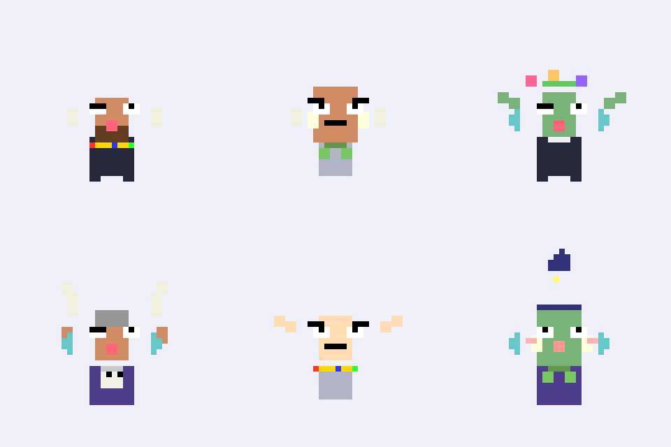

# 奇幻像素头像生成器 (Fantasy Pixel Avatar Generator)

一个使用 Pygame 编写的交互式奇幻风格像素头像生成器。每次点击鼠标都会生成一个随机组合的幽默、可爱、搞怪的大头照式头像。

An interactive fantasy-style pixel avatar generator written in Pygame. Each mouse click generates a randomly combined humorous, cute, and quirky portrait-style avatar.

## 功能特点 (Features)

### 用户交互 (User Interaction)
- 鼠标点击触发头像生成
- 每次点击都会随机组合头像元素并重新绘制

### 头像元素 (Avatar Elements)

#### 基础属性 (Basic Attributes)
- **性别 (Gender)**: 男 / 女 (Male / Female)
- **种族 (Race)**: 兽人、精灵、矮人、地精 (Orc, Elf, Dwarf, Goblin)
- **皮肤颜色 (Skin Color)**: 多种奇幻肤色 (Various fantasy skin tones)
  - 绿色 (兽人/地精)
  - 浅色 (精灵)
  - 棕褐色 (矮人)
  - 淡绿色、淡蓝色、桃色等

#### 表情 (Expressions)
- 微笑 (Smile) - 快乐的笑容
- 生气 (Angry) - 愤怒的眉毛和皱眉
- 滑稽 (Silly) - 吐舌头和眨眼
- 呆萌 (Cute) - 圆圆的嘴和脸红

#### 头饰 (Headwear)
- 角盔 (Horn Helmet) - 带角的金属头盔
- 花冠 (Flower Crown) - 彩色花朵和绿叶
- 巫师帽 (Wizard Hat) - 高高的尖顶帽配星星装饰
- 触手帽 (Tentacle Hat) - 章鱼风格的帽子
- 无 (None)

#### 首饰 (Jewelry)
**项链 (Necklaces)**:
- 骷髅吊坠 (Skull Pendant)
- 宝石项圈 (Gem Collar)
- 叶子项链 (Leaf Necklace)
- 无 (None)

**耳饰 (Earrings)**:
- 圆环 (Hoop)
- 羽毛 (Feather)
- 骨头 (Bone)
- 无 (None)

#### 衣服 (Clothing)
- 长袍 (Robe) - 流动的法师长袍配腰带
- 盔甲 (Armor) - 板甲装备
- 束腰外衣 (Tunic) - 简单的束腰外衣
- 斗篷 (Cloak) - 神秘的斗篷配金色扣环

### 绘图风格 (Drawing Style)
- 像素风格 (使用 `rect()` 模拟像素块)
- 画面尺寸: 320x320 像素
- 使用简洁色块，无渐变
- 每个元素用函数模块化绘制，便于组合和扩展

## 如何运行 (How to Run)

### 前置要求 (Prerequisites)
1. Python 3.6 或更高版本 (Python 3.6 or higher)
2. 安装 Pygame:
   ```bash
   pip install pygame
   ```

### 运行步骤 (Running the Program)
1. 打开终端/命令行 (Open terminal/command line)
2. 导航到项目目录 (Navigate to the project directory)
3. 运行程序:
   ```bash
   python3 fantasy_avatar_generator.py
   ```
   或 (or)
   ```bash
   python fantasy_avatar_generator.py
   ```
4. 在弹出的窗口中点击鼠标任意位置生成新头像 (Click anywhere in the window to generate a new avatar)
5. 关闭程序: 点击窗口的关闭按钮或按 ESC 键 (Close the program: Click the window close button or press ESC)

## 代码结构 (Code Structure)

### 主要函数 (Main Functions)

- `setup()` - 初始化 Pygame 窗口 (Initialize Pygame window)
- `generate_avatar()` - 生成随机头像组件 (Generate random avatar components)
- `draw_avatar()` - 绘制完整头像 (Draw complete avatar)
- `main()` - 主游戏循环，处理事件 (Main game loop, handle events)

### 绘制模块 (Drawing Modules)

#### 头部相关 (Head-related)
- `draw_head(screen, race, skin_col)` - 绘制头部/脸部 (Draw head/face)
- `draw_expression(screen, expression)` - 绘制面部表情 (Draw facial expression)

#### 配饰相关 (Accessory-related)
- `draw_headwear(screen, headwear_type, race)` - 绘制头饰 (Draw headwear)
- `draw_necklace(screen, necklace_type)` - 绘制项链 (Draw necklace)
- `draw_earrings(screen, earring_type)` - 绘制耳环 (Draw earrings)

#### 服装相关 (Clothing-related)
- `draw_clothes(screen, clothes_type, skin_col)` - 绘制服装/盔甲 (Draw clothes/armor)

### 全局变量 (Global Variables)

- `PIXEL` - 像素块大小 (8x8)
- `GENDERS` - 性别选项列表
- `RACES` - 种族选项列表
- `SKIN_COLORS` - 皮肤颜色选项列表
- `EXPRESSIONS` - 表情选项列表
- `HEADWEAR` - 头饰选项列表
- `NECKLACES` - 项链选项列表
- `EARRINGS` - 耳环选项列表
- `CLOTHES` - 服装选项列表

## 扩展建议 (Extension Ideas)

1. 添加更多种族 (如龙人、鱼人等)
2. 增加更多配饰选项 (如眼镜、面具、胡须等)
3. 添加保存功能 (按键保存当前头像为图片)
4. 实现头像动画效果
5. 添加背景元素和装饰
6. 实现颜色主题系统
7. 添加头像名称生成器

## 技术细节 (Technical Details)

- **语言**: Python 3 with Pygame
- **画布尺寸**: 320x320 像素
- **像素块大小**: 8x8 像素
- **绘图方法**: 使用 `pygame.draw.rect()` 函数绘制像素块
- **事件处理**: 使用 `pygame.MOUSEBUTTONDOWN` 检测鼠标点击

## 许可证 (License)

本项目采用开源许可，可自由使用和修改。

## Legacy Processing Version

The original Processing Python Mode version is still available as `fantasy_avatar_generator.pyde` for reference. However, the recommended version is the Pygame implementation (`fantasy_avatar_generator.py`) which:
- Runs natively in Python without Processing dependencies
- Is easier to distribute and package as a standalone executable
- More accessible to Python developers
- Can be integrated into other Python projects easily

## 作者 (Author)

Created for interactive design learning and fun!

## 截图 (Screenshots)

运行程序后，每次点击鼠标都会生成一个独特的奇幻角色头像。尝试点击多次，发现各种有趣的组合！

Try clicking multiple times to discover various interesting combinations of fantasy characters!



*Examples of randomly generated avatars showing different races, expressions, headwear, and clothing*